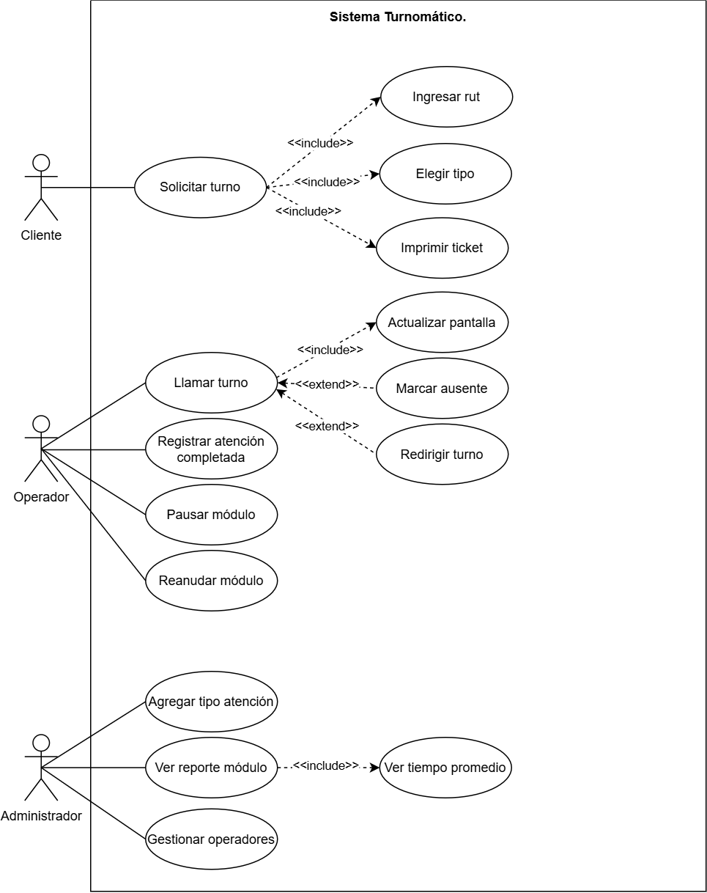
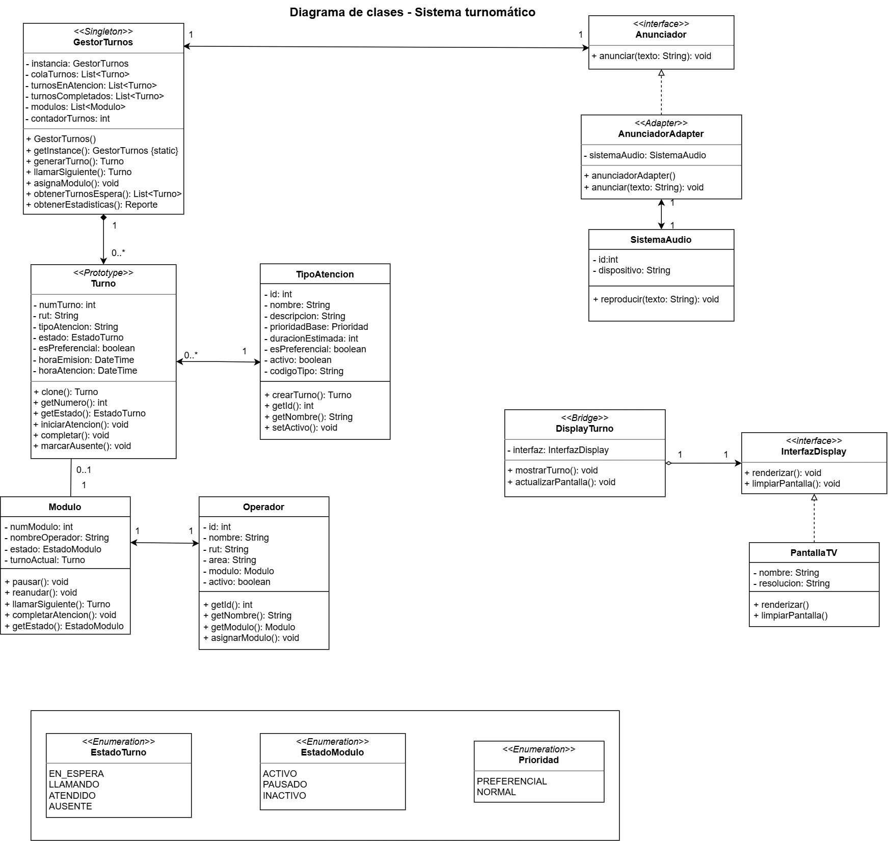
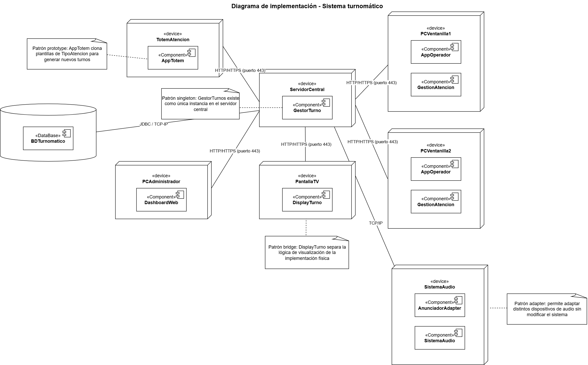

  
# Sistema turnomático
### Gestión Digital de Turnos

*Modelado Arquitectónico con Patrones de Diseño*

## Descripcion general del sistema
Este proyecto corresponde a un sistema turnomático que es una solución de gestión digital de turnos diseñada para entornos de atención presencial, tales como farmacias, bancos, centros de salud y organismos públicos. Su propósito es optimizar el flujo de atención al cliente mediante la emisión automatizada de tickets numerados, la administración centralizada de colas de espera y la visualización en tiempo real del turno en curso a través de una pantalla de display.

El sistema permite que los clientes soliciten turnos mediante un tótem de autoservicio, ingresando su RUT y seleccionando el tipo de atención requerido. Posteriormente, el sistema genera un ticket con el número de atención y gestiona el llamado de turnos mediante pantallas y sistema de audio.

**Objetivos del sistema:**
permitir atención preferencial y normal.
Administrar módulos de atención.
Mostrar turnos en pantallas.
Anunciar turnos mediante sistema de audio.
Generar estadísticas básicas de atención.

El sistema contempla tres actores principales:

**Cliente** : Interactúa con el tótem de autoservicio para solicitar su turno 
**Operador** : Gestiona la atención desde su módulo de ventanilla 
**Administrador** : Supervisa el sistema, configura tipos de atención y accede a reportes 

## Diagrama de casos de uso

*Diagrama de casos de uso — Sistema turnomático*

### Actores del Sistema

- **Cliente** — Actor principal que interactúa con el tótem físico para obtener un turno de atención.
- **Operador** — Personal de ventanilla responsable de llamar turnos, registrar atenciones y gestionar el estado de su módulo.
- **Administrador** — Responsable de la configuración del sistema, la gestión de operadores y el acceso a reportes de rendimiento.

### Relaciones `<<include>>`

La relación `<<include>>` se aplicó en aquellos casos donde un caso de uso base siempre requiere la ejecución de otro para poder completarse:

> **Solicitar Turno → Ingresar RUT**
El sistema no puede generar un turno sin identificar previamente al cliente. Esta validación es un paso ineludible del proceso.

> **Solicitar Turno → Elegir Tipo de Atención**
La selección del servicio requerido es condición necesaria para que el sistema determine la cola correspondiente y genere el ticket correcto.

> **Solicitar Turno → Imprimir Ticket**
Una vez generado el turno, el tótem siempre emite un comprobante físico. Esta acción es automática e inseparable del proceso de solicitud.

> **Llamar Turno → Actualizar Pantalla**
Cada vez que el operador llama un turno, el sistema actualiza automáticamente la pantalla de display. Esta sincronización es obligatoria para el correcto funcionamiento del sistema.

> **Ver Reporte por Módulo → Ver Tiempo Promedio**
El reporte incorpora de manera inherente las métricas de tiempo promedio de atención, ya que estas constituyen el indicador principal de rendimiento operacional.

### Relaciones `<<extend>>`

La relación `<<extend>>` se utilizó para modelar comportamientos opcionales o condicionales:

> **Llamar Turno → Marcar Turno como Ausente**
Ocurre únicamente cuando el cliente no se presenta al ser llamado. No es parte del flujo normal de atención, sino una excepción que el operador puede registrar.

> **Llamar Turno → Redirigir Turno**
Se activa cuando el cliente llega a un módulo que no corresponde al tipo de atención solicitado. El operador puede reasignar el turno sin necesidad de generar uno nuevo.

---

## Diagrama de clases

*Diagrama de clases con patrones de diseño aplicados*

### Patrones de Diseño Aplicados

#### Singleton — `GestorTurnos`

**Problema que resuelve:** El sistema requiere un único controlador central que administre todas las colas de turnos, módulos activos y estadísticas globales. La existencia de múltiples instancias provocaría inconsistencias críticas como la duplicación de números de turno.

**Implementación:** La clase `GestorTurnos` implementa el patrón mediante tres mecanismos:
- Constructor privado que impide la instanciación directa
- Atributo estático `instancia: GestorTurnos` que conserva la única referencia
- Método estático `getInstance(): GestorTurnos` que garantiza siempre la misma instancia

**Justificación:** En un entorno de farmacia o banco, el GestorTurnos es el cerebro que conoce en todo momento el estado de cada turno y módulo. Su unicidad es un requisito arquitectónico fundamental, reflejado también en el diagrama de implementación donde reside exclusivamente en el ServidorCentral.

---

####  Prototype — `Turno` y `TipoAtencion`

**Problema que resuelve:** El sistema debe generar múltiples turnos de forma eficiente a lo largo de la jornada. Construir cada objeto `Turno` desde cero sería costoso e innecesariamente complejo, especialmente considerando que cada tipo de atención comparte una estructura base.

**Implementación:** La clase `TipoAtencion` actúa como plantilla base, encapsulando atributos por defecto como `prioridadBase`, `duracionEstimada` y `esPreferencial`. Su método `crearTurno(): Turno` invoca el método `clone()` de `Turno`, generando una copia del objeto base a la que se le asignan el número correlativo y la hora de emisión.

**Justificación:** Cuando un cliente selecciona un tipo de atención en el tótem, el sistema clona la plantilla correspondiente y le asigna el número siguiente en la cola, garantizando consistencia en los atributos y agilizando la generación de turnos.

---

####  Adapter — `AnunciadorAdapter` y `SistemaAudio`

**Problema que resuelve:** Turnomático debe integrarse con un sistema de audio externo que anuncia los turnos llamados por parlantes, cuya interfaz no es compatible con la interfaz interna del sistema.

**Implementación:** La interfaz `Anunciador` define el método `anunciar(texto: String): void`. La clase `AnunciadorAdapter` implementa esta interfaz y traduce internamente la llamada al método `reproducir(texto: String): void` del `SistemaAudio` externo, adaptando los parámetros necesarios sin modificar ninguna de las dos partes.

**Justificación:** Este patrón permite integrar distintos dispositivos de audio sin modificar la lógica interna de Turnomático. En el diagrama de implementación, el nodo `SistemaAudio` contiene tanto el `AnunciadorAdapter` como el componente `SistemaAudio`, reflejando físicamente esta separación.

---

####  Bridge — `DisplayTurno` e `InterfazDisplay`

**Problema que resuelve:** La lógica que determina qué información mostrar debe estar desacoplada del mecanismo físico que la presenta, permitiendo incorporar nuevos tipos de pantalla sin modificar la lógica central del sistema.

**Implementación:** `DisplayTurno` representa la abstracción y contiene una referencia a `InterfazDisplay`. Delega el renderizado a esta interfaz, cuya implementación concreta es `PantallaTV`, que define los métodos `renderizar()` y `limpiarPantalla()`.

**Justificación:** Aunque hoy el sistema utiliza únicamente una pantalla TV, el diseño anticipa la posibilidad de incorporar otros medios de visualización sin impacto en la lógica del servidor ni en la clase `DisplayTurno`.

---

## Diagrama de implementación

*Distribución física del sistema en nodos de hardware*

### Nodos del Sistema

| Nodo | Componentes | Descripción |
|:---|:---|:---|
| TotemAtencion | AppTotem | Tótem de autoservicio donde el cliente ingresa su RUT, elige el tipo de atención y recibe su ticket. Aplica el patrón Prototype. |
| ServidorCentral | GestorTurno | Núcleo del sistema. Instancia única del GestorTurnos que administra colas, módulos y estadísticas. Aplica el patrón Singleton. |
| PCVentanilla1 | AppOperador, GestionAtencion | Computador de la primera ventanilla de atención. Permite llamar turnos y registrar atenciones. |
| PCVentanilla2 | AppOperador, GestionAtencion | Computador de la segunda ventanilla. Misma funcionalidad que la ventanilla N°1, permitiendo atención paralela. |
| PantallaTV | DisplayTurno | Monitor en sala de espera que muestra el turno llamado y el módulo asignado. Aplica el patrón Bridge. |
| PCAdministrador | DashboardWeb | Equipo del administrador para configuración del sistema, gestión de operadores y visualización de reportes. |
| SistemaAudio | AnunciadorAdapter, SistemaAudio | Nodo de audio externo que anuncia los turnos por parlantes. Integrado mediante el patrón Adapter. |
| BDTurnomatico | — | Base de datos central que persiste el historial de turnos, configuración de tipos de atención y registros de operadores. |

### Protocolos de Comunicación

| Conexión | Protocolo |
|:---|:---|
| Todos los nodos → ServidorCentral | HTTP/HTTPS (puerto 443) |
| ServidorCentral → BDTurnomatico | JDBC / TCP-IP |
| PCVentanilla2 → SistemaAudio | TCP/IP |

### Decisiones Arquitectónicas

> La centralización del GestorTurnos en el servidor garantiza consistencia de datos y elimina conflictos entre instancias — **Singleton**

> La generación de turnos por clonación de plantillas en el tótem reduce la carga del servidor y acelera la respuesta al cliente — **Prototype**

> El desacoplamiento entre lógica de visualización y dispositivo físico permite escalar a otros medios sin modificar el servidor — **Bridge**

> La integración con el sistema de audio mediante Adapter protege al sistema de cambios en APIs o dispositivos externos — **Adapter**

---

## Reflexiones Finales

El modelado arquitectónico del Sistema turnomático permitió comprender de manera práctica la importancia de aplicar patrones de diseño como respuesta a problemas concretos, y no como recursos decorativos del diagrama.

La transición desde el diagrama de casos de uso hasta el diagrama de implementación evidenció cómo cada decisión funcional tiene una repercusión directa en la estructura del software y en su distribución física. La identificación de actores y relaciones en la fase inicial condicionó el diseño de las clases, y estas a su vez determinaron la arquitectura de los nodos físicos.

La incorporación de la base de datos y el sistema de audio como nodos independientes en el diagrama de implementación refleja una visión más realista del sistema desplegado, donde cada componente cumple una responsabilidad específica y se comunica mediante protocolos definidos.

En términos de aprendizaje, este trabajo consolidó la comprensión de que el diseño orientado a objetos no consiste en crear clases arbitrariamente, sino en identificar responsabilidades, delimitar dependencias y construir arquitecturas comprensibles, mantenibles y adaptables al cambio.

---

*Modelado realizado por Aylin Carrera · Proyecto académico · UML y patrones GoF*

